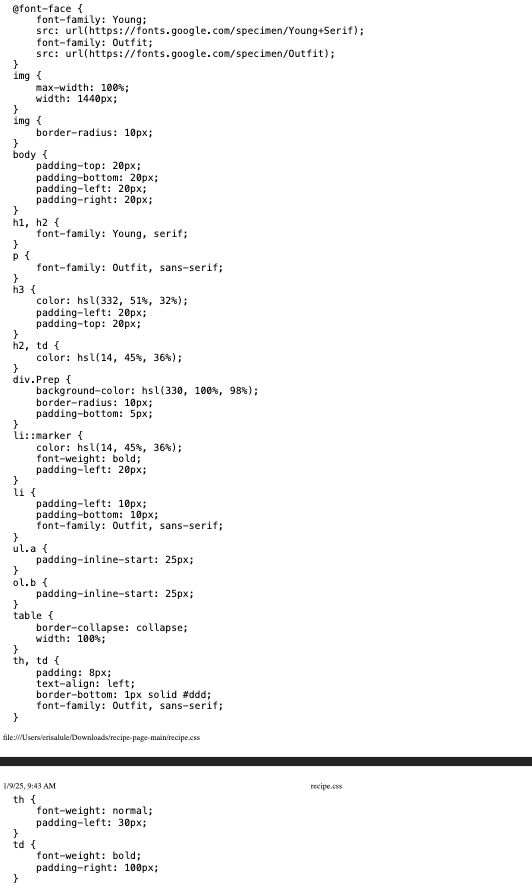

## Table of contents

- [Overview](#overview)
  - [The challenge](#the-challenge)
  - [Screenshot](#screenshot)
- [My process](#my-process)
  - [Built with](#built-with)
  - [What I learned](#what-i-learned)
  - [Continued development](#continued-development)
  - [Useful resources](#useful-resources)
- [Author](#author)
- [Acknowledgments](#acknowledgments)

### The Challenge
Recipe page using HTML and CSS

### Screenshot
Recipe screenshot.jpg
## My process
Completing the HTML was pretty straightforward. The paragraphs and headings were not too difficult to complete but including the picture and the table was. I had to use MDN as reference to know what to do. CSS on the other hand wasn't as straightforward. I was constantly referencing MDN and W3Schools.
### Built with

- Semantic HTML5 markup
- CSS 
### What I learned
I learned how to include fonts in CSS. The only issue is I couldn't get Young Serif to display how it was in the original design.

```css
font-face {
    font-family: Young;
    src: url(https://fonts.google.com/specimen/Young+Serif);
    font-family: Outfit;
}
```
I learned how to change the color and boldness of the list markers

```css
li::marker {
    color: hsl(14, 45%, 36%);
    font-weight: bold;
    padding-left: 20px;
}
```
### Continued development
I need to familiarize myself more with the different units of measurements. I only used px and percentages but I would like to learn more about using ems.
### Useful resources
(https://developer.mozilla.org)
(https://www.w3schools.com)
## Author

Erisa Lule
Elule87
